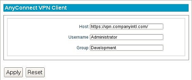

AnyConnect VPN
--------------

The following section describes the basic steps for establishing an
AnyConnect VPN connection.

The General Section
~~~~~~~~~~~~~~~~~~~

Host
    Type in the appropriate server location of the VPN host.

Username
    This is the default username that will be used to gain VPN access.

Group
    The group name that the username belongs to.

.. raw:: LaTeX

     \newpage	