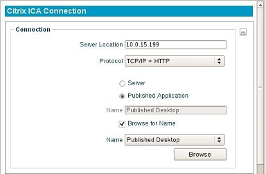
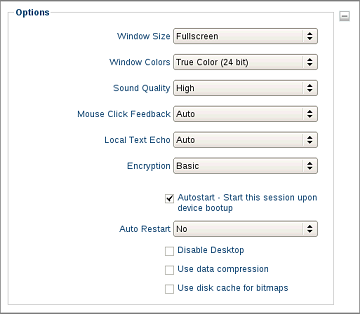

Citrix ICA
----------

The Citrix Receiver™ client allows a connection to Citrix XenAppView
Servers (formerly known as Presentation Server™). This Citrix client
also contains the necessary plug-in used for connecting to XenDesktop
via the thin client's local web browser.

The Connection Section
~~~~~~~~~~~~~~~~~~~~~~

The first section displayed for a Citrix ICA session is **Connection**.
This form panel will already be expanded.

Server Location
    Type in the IP address or hostname of the server.
    
Protocol
    Select the appropriate protocol needed to connect to the
    server. There may be multiple methods available for connecting to the
    server:
  
    - **Server** - To connect to the desktop of the server, click the 
      radio button called **Server**.
    - **Published Application** - To directly connect to a published 
      application on the server, select the radio button called 
      **Published Application**.

Browse for Name
    Mark the checkbox called **Browse for Name**,
    then click the **Browse** button. This will contact the server and
    populate the list. Click the down arrow on the Name menu and select
    the server name or published application.

.. raw:: LaTeX

     \newpage
	
The Options Section
~~~~~~~~~~~~~~~~~~~

Window Size
    Select the type of window the session will display in.

Full screen
    The session will take up the entire display.
    
Fixed Size
    A fixed window size may be selected, such as
    **640x480**, **800x600**, and **1024x768**.

Percentage Based
    A size may be selected that is based on the
    percentage of available desktop display, such as **25%**, **50%**,
    and **75%**.

Seamless
    When using the **Published Application** feature,
    selecting Seamless mode will launch applications directly on the
    desktop, without using the Citrix Window.

Windows Colors
    Color depth options are **16 colors**, **256
    colors**, **16-bit**, and **24-bit**.

Sound Quality
    Adjust the sound from **Low**, **Medium**, or
    **High Quality**.

Citrix SLR (Speed Screen Latency Reduction) Options
    Enabling the following two options are usually only needed when high latency is occurring or poor bandwidth conditions exist.
    
Mouse Click Feedback
    The mouse cursor will change to an
    hourglass as soon as a user performs a mouse click on an event and
    will wait for a response from the server before it changes back.

Local Text Echo
    This option allows a user to see the character
    they type into their session on the screen, without this key press
    hitting the actual server at that time.

Encryption
    Select the appropriate level of encryption to be used
    when connecting to this Citrix Server.

Autostart
    Enable this checkbox to automatically launch this
    session each time the thin client completes its boot procedure.

.. raw:: LaTeX

     \newpage	
	
Auto Restart
    Select **Yes** or **Prompt** to automatically
    restart the connection.
  
    - **Yes** - Once the session is terminated, the session will 
      automatically restart. There is no way for the end-user to 
      stop it from occurring every time it closes.
    - **Prompt** - Once the session is terminated, the user will receive 
      a **YES/NO** prompt asking them if they wish to reconnect to the session.

Disable Desktop
    This option disables desktop access, ensuring that only this connection is 
    accessible. Logging off from the server will power off the thin client, and 
    powering on the thin client will bypass the operating system's desktop and 
    immediately log in to the server. To revert this option, an LTM administrator 
    will need to push to the thin client a connection that does not have this 
    feature enabled. Once the connection has been pushed, reboot the thin client.
    
    .. CAUTION::
        Be mindful of auto-restart usage, to avoid cases where a session will relaunch when disable desktop is no longer needed.

Use data compression
    In an environment where system and client
    resources are not a concern, data compression can be used to decrease
    the amount of data that must be sent across the network.
  
Use disk cache for bitmaps
    Allows graphical objects to be stored
    in the local disk cache on the client device.

The Firewall Settings Section
~~~~~~~~~~~~~~~~~~~~~~~~~~~~~

Use alternative address for firewall connection
    Mark this checkbox
    if the session needs to connect to the Citrix server's external IP
    address. The *external* address for the server is specified as the
    *alternate* address.

Proxy Settings
    If the Citrix environment uses a proxy server, an
    appropriate type will need to be selected from the **Proxy Type** field.
    Enter the address of the proxy server and port number in the **Proxy
    Address** and **Proxy Port** fields, respectively.

The User Logon Section
~~~~~~~~~~~~~~~~~~~~~~

User Name
    Specify the name of a user account to log on as. This is
    an optional field.

Domain
    Specify the domain to log on to. This is an optional field.

The Application Section
~~~~~~~~~~~~~~~~~~~~~~~

Application
    Specifies the path of the application on the Citrix
    server to be automatically launched when the connection is made. This is
    an optional field.

Working Directory
    Specifies the working directory used for the
    application.

.. raw:: LaTeX

     \newpage	