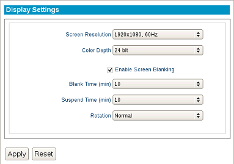

.. index::
   single: Display

Display Settings
----------------

This section describes the display options available for a single
monitor attached to a terminal.

   
1. Open the **LeTOS Control Panel** from the **Start** menu.

2.  Click the **Display** settings on the left-hand side of the
    **Control Panel**, under the **System** settings.
	
    Screen Resolution
        Select the desired resolution from the dropdown list. **Auto-detect** may be selected to allow LeTOS to automatically choose the best resolution for the attached monitor.

    Color Depth
        All supported color depths for the monitor will be listed in this dropdown box.

    Enable Screen Blanking
        Checking this box will reveal two timeout values for screen blanking and suspend time.
   
    Blank Time (min)
        This is the time needed before the system will blank the monitor, setting it into a screen-saving state.
   
    Suspend Time (min)
        This is the time needed before the monitor will go into a suspended, power-saving mode.
   
    Rotation
        This allows the screen display to be rotated to accomodate for specific monitor setups.

Once finished, press the **Apply** button for the changes to take
effect. All display changes will take effect immediately.

.. raw:: LaTeX

     \newpage   

Dual Monitors
-------------

This section describes how to set up and configure dual monitors for
terminals that support them.

1. While the unit is turned off, attach both monitors to the thin
   client.

2. Turn on the thin client.

3. Open the **LeTOS Control Panel** from the **Start** menu.

4. Click the **Display** settings on the left-hand side of the
   **Control Panel**, under the **System** settings.

5. Under the **Configuration** tab, the settings for **Color Depth**
   and **Screen Blanking** options will be available. These settings
   apply to both monitors regardless of screen positions or visual
   connections used.

6. To adjust specific properties for each monitor, click the
   **Monitors** button along the top of the **Control Panel**. The
   names of the two monitors attached to the thin client will be
   presented. The exact names will vary depending on how they are
   detected on that particular thin client.  
	
7. Click one of the monitor names from the list. This will open a
   configuration screen that contains **Screen Resolution** and
   **Position** properties for that specific monitor.

    .. figure:: media/image014.png
       :alt: Dual Monitor Display Settings
        
    Screen Resolution
        Select the desired resolution from the
        dropdown list. **Auto-detect** may be selected to allow LeTOS to
        automatically choose the best resolution for the attached monitor.
     
    Position
        - **Left of** or **Right of** - If the monitors are positioned in a side-by-side arrangement, then this will specify one of the monitors as placed to the **Left of** or **Right of** the opposite monitor.
        - **Above** or **Below** - If the monitors are positioned in a top and bottom arrangement, then this will specify one of the monitors as placed **Above** or **Below** the opposite monitor.
        - **Clone** - Choosing the **Clone** option will cause the display to be duplicated on both monitors. (Also known as “Mirrored.”). **Clone** is the default behavior for dual monitors when powered on for the first time.
        - **Offset** - When selecting the offset option, two additional fields for **X** and **Y** coordinates will be present. For example: 50x50 will cause the display to be positioned 50 pixels left of and 50 pixels higher than its normal centered state.

        .. NOTE::  
          The X plane is Horizontal. The Y plane is Vertical.

    Primary display
        Enabling this option will assign the currently selected monitor to be the primary display for extended dual monitor setups.

When finished, press the **Apply** button. Changes to the display will
take effect immediately.

.. raw:: LaTeX

     \newpage   
