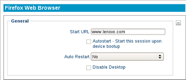

===================
Firefox Web Browser
===================

The following section describes the steps for configuring the local
Firefox web browser.

The General Section
-------------------

Start URL
    Specifies the initial web page to appear when the browser
    is first launched.

Autostart
    Enable this checkbox to automatically launch this session
    after the thin client completes its boot procedure.

Auto Restart
    Select **Yes** or **Prompt** to automatically restart
    the connection.

    - **Yes** - Once the session is terminated, the session will 
      automatically restart. There is no way for the user to stop it 
      from occurring.

    - **Prompt** - Once the session is terminated, the user will receive 
      a **YES/NO** prompt asking them if they wish to reconnect to the 
      session.

Disable Desktop
    This option disables desktop access, ensuring that only this connection is 
    accessible. Logging off from the server will power off the thin client, and 
    powering on the thin client will bypass the operating system's desktop and 
    immediately log in to the server. To revert this option, an LTM administrator 
    will need to push to the thin client a connection that does not have this 
    feature enabled. Once the connection has been pushed, reboot the thin client.	 
    
    .. CAUTION::
        Be mindful of auto-restart usage, to avoid cases where a session will relaunch when disable desktop is no longer needed.

Click the **Apply** button to save the connection. Double-click the
Firefox icon the desktop to launch the browser session. A browser
plug-in for Flash Player has been pre-installed.

.. raw:: LaTeX

     \newpage

The Proxy Settings Section
--------------------------

Auto-detect proxy settings for this network
    This option will allow Firefox to automatically detect the proxy 
    settings for your network.

Use system proxy settings
    This option allows the proxy settings
    configured for the system to be used.

Manual proxy configuration
    Choose this option to specify which
    proxy server to use, if more than one is available. Complete these
    fields listed.

Automatic proxy configuration
    If there is a proxy configuration
    (**.pac**) file available, use this field to specify the URL address to
    the **.pac** file.

The Kiosk Mode Section
----------------------

The Firefox web browser includes a Kiosk Mode. When this option is
activated, certain options within the web browser can be hidden from
use, and the ability to exit can be disabled.

Show Menu Bar
    With this box checked, the **Menu** bar will appear.
    This option can be enabled or disabled regardless of Kiosk Mode status.

Enable Kiosk Mode
    This checkbox must be enabled to even view the
    other three options below:

    - Show Navbar in Kiosk
        With this box checked, the user has 
        access to the **Address** bar to change websites, and access to 
        the **Back, Forward, Stop,** and **Refresh** buttons in 
        the **Toolbar**.

    - Autohide Navbar in Kiosk
        Check this box to allow the Navbar 
        to automatically hide itself when it is not in use.

    - Allow Quit
        This will allow easy access to any exit 
        options available.

    .. NOTE::
        To use Kiosk Mode correctly, make sure there is a Starting URL in the requested field. Launching Firefox in Kiosk Mode will automatically launch a Full Screen, inescapable Firefox session for end-users with Internet-ONLY access. The only way to leave the browser is to shut down the thin client.
    
.. raw:: LaTeX

     \newpage