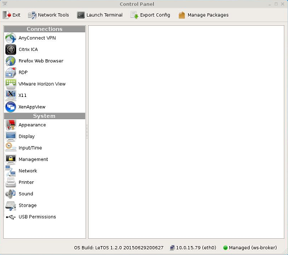

===============
Getting Started
===============

To get started, the following actions are necessary:

+  Check that the thin client is connected to the network.

+  If a management server has been set up in the network, check that the
   thin client was able to contact the management server and is in managed
   mode.

+  Create a desktop shortcut to allow thin client users to get connected to
   a remote server. (See the :ref:`connections-reference` chapter for more information.)

To check the network connection status, click the **Start** button and
then select **Control Panel**.

.. index::
   single: Control Panel
   

Along the bottom of the **Control Panel** is a row of status messages.
These messages include the |OS| build number, the terminal's current IP
address, and a Thin Client Management Connection Indicator.

|OS| default factory setting is DHCP. If there is a DHCP server on the
network, the status bar should show the leased IP address. If the thin
client is going to use a fixed IP address please refer to this guide's
network section. A message of no IP address will appear if network
connectivity is lost or was never established in the first place. This
may be related to a loose or faulty network cable. It may also be an
indication of DHCP issues. If troubleshooting a network issue is
necessary, please refer to the network diagnostic section below.

Along with the IP address, the **Control Panel** status section also
shows whether the thin client is in managed or unmanaged (stand alone)
mode. By default, |OS| based thin clients try to locate a
management server. If a management server is found, the terminal
switches to managed mode, where it “pulls” its configuration from the
management server. If not, it will stay in standalone/unmanaged mode and
use its local configuration.

The **Control Panel** status area also shows the OS build. This is a
string based on the |OS| version and the build date.

.. |OS| replace:: LeTOS

.. toctree::
   :maxdepth: 1
    
   Installation.rst
   FirstBootWizard.rst
   ManagementServerSplashScreen.rst
   ManagemementServerIndicator.rst
   ControlPanel.rst
   NetworkTools.rst
   AgentSystemInformation.rst
   LocalStorage.rst
   FileManagement.rst

