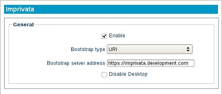

.. _imprivata-reference:

Imprivata
---------

.. index::
   single: Imprivata

LeTOS includes Imprivata One-Sign support for one-touch sign-in solutions. With
One-Sign, various single sign-on methods are available. Support is included for
proximity card readers.

Installing the Imprivata Package
~~~~~~~~~~~~~~~~~~~~~~~~~~~~~~~~

.. NOTE::
   If Imprivata One-Sign is already pre-installed, then these steps may be
   skipped. Proceed to the **Adding Certificates** section below.

Some images may require a package to be installed to use One-Sign. To install
One-Sign to a device:

1. Download the latest Imprivata package. Save the file to a flash drive, or 
   host the file to an HTTP(S) or FTP server.
2. Power on the device that will have Imprivata installed.
3. Open the Control Panel. Click on the **Manage Packages** button at the top 
   of the Control Panel window.
4. Refer to the steps given in the :ref:`packages-reference` section. Follow
   the instructions given based on the installation method used.
5. Once the package is installed, the device will need to reboot. After the 
   reboot, an Imprivata module will be available within the Control Panel.

Alternatively, the Management Appliance can be used to remotely install the 
package to multiple devices. For more information, refer to the LTM 
Administration Guide's Imprivata section.

Adding Certificates
~~~~~~~~~~~~~~~~~~~

Devices that will be using One-Sign will require a certificate to access 
servers. This certificate must be extracted from the Imprivata servers and 
installed to devices through the LTM Management Server. For more details on
installing the certificate, refer to the LTM Administration Guide's Imprivata
section.

For more information, refer to the Imprivata server's documentation.
   
1. On a local machine, open a web browser and enter the Imprivata server 
   address. Internet Explorer is recommended for this step. Use Port 81 in the 
   address to access the web interface.
   
   .. NOTE::
      The Imprivata Admin Console is only compatible with Internet Explorer 8.0
      and above. The Imprivata Appliance Console will work with most browsers.   
   
2. A choice between the Admin Console and the Appliance Console will be present. 
   Select the **Appliance Console** and login with Administrator credentials.
3. Open the **Security** tab, located at the top of the screen. The SSL page
   will contain a `Download the certificate` link. Click on this link and 
   select the option to *Save* the certificate to the local disk. For other web
   browsers, right-click on the link and select "Save As..." to save the 
   certificate to the local disk.
   
.. figure:: media/image039.png
   :alt: Download the certificate
   
4. Enter the Management Server's address in a web browser to access the Web 
   Appliance. Access the **Certificates** inventory page. Click on the **+** 
   icon to add a new certificate. Enter a name for the certificate and click on
   the **Browse** button. Add the Imprivata certificate. Once finished, click 
   on the checkmark icon to add the certificate to the inventory.
5. Go to the **Devices** inventory page. Select all the devices that have 
   One-Sign and will need the Imprivata certificate. Open the Options menu 
   (shaped like a gear) and highlight **Apply** from the menu for new options. 
   Choose the **Certificates** option.
6. Select the Imprivata certificate from the drop-down menu. The certificate 
   can be set to install to devices immediately or on a scheduled time. Once 
   devices have installed the certificate, they are ready to run. A reboot is
   not necessary.

Enabling Imprivata
~~~~~~~~~~~~~~~~~~

Finally, enable Imprivata One-Sign on devices. These are the steps to enable One-Sign
locally.

1. Power on the thin client that will be using the Imprivata sign-in services.
2. Open the Control Panel and locate the Imprivata module. 
3. Select the option to enable Imprivata One-Sign. Then, select one of the 
   **Bootstrap type** options presented. The **Bootstrap server address** will 
   vary, depending on the **Bootstrap type**: 
   
   - **SRV**- The SRV record, based on the name set in the DNS. This record 
     will provide information to the bootstrap server that makes access easier,
     especially for larger installations. The record returned must be a 
     fully-qualified domain name of the bootstrap server, and not the DNS IP 
     address. It should match the address given in the Imprivata Admin Control 
     Panel.
   
   - **Server Address**- The fully-qualified domain name of the bootstrap 
     server. Like **SRV**, the **Bootstrap server address** is given in the 
     Imprivata Admin Control Panel. If `Require Valid SSL Certificate` is 
     disabled, the Alias CNAME may also be used.
     
     .. NOTE::
        For **Server Address**, if the `https://` is not included, it will be 
        included automatically. However, the system will not upgrade `http://` 
        to `https://`.
   
4. There is an option to make the client require a valid SSL certificate. This
   will ignore self-signed errors and hostname mismatch errors. If this option
   is enabled, an Imprivata certificate must be installed locally. This option
   is more secure and will not ignore any SSL errors if they occur.
5. An option is available to disable the device's desktop. This locks down the 
   kiosk for direct access to Citrix or VMware.

   
6. Once all the information has been entered, click on **Apply** to save the 
   changes made. A snapshot will need to be taken to ensure that the new 
   settings will persist on reboot.
7. Reboot the device. When the device powers back on, the Imprivata login 
   screen will take the place of the desktop.
   
.. raw:: LaTeX

     \newpage   