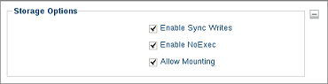

.. index::
   single: Local Storage

.. _localstoragesettings:

Local Storage Settings
======================

The **Local Storage** section of the **Control Panel** allows the user
to choose one of two options pertaining to persistence.

1. Open the **LeTOS Control Panel** from the **Start** menu.

2. Click the **Local Storage** settings icon on the left-hand side of
   the **Control Panel** under the **System** settings.

    .. figure:: media/image016.png
       :alt: Local Storage Settings

    Clear Local Storage
        Press this button to clear out all configurations currently stored. Reboot the thin client after this option has been selected to clear out all locally stored configurations. This is a factory reset and will result in starting the first boot wizard again.

        .. NOTE::
            Clearing Local Storage will not remove any software packages that have been installed. Software packages will need to be removed separately.
        
    Take Snapshot
        Press this button to capture the thin client’s current connections and settings configuration. Rebooting the terminal will allow the terminal to restore to the state it was in when the snapshot was taken. Taking a snapshot after applying new changes is neccessary to ensure that the adjustments will be retained after a reboot.

.. raw:: LaTeX

     \newpage

Additionally, the Local Storage module houses advanced **Storage Options** for 
other features  that may further enhance a user's experience. All options are 
enabled by default.

Enable Sync Writes
    This feature syncs the writing of information to local storage. With this feature enabled, data written to is committed to stable storage. This will guarantee that the information can be read and accessed regardless of a crash or other issue. Disabling this option will increase the performance of writing to storage.

    .. CAUTION::
        If this feature is disabled, do not attempt to unplug the device before it has finished writing to storage or data may become lost or corrupted.
    
Enable NoExecs
    This option will prevent file execution from mounted removable storage devices. Disabling this option will allow file execution from these external devices. This option does not affect the internal local storage.
   
Allow Mounting
    This will allow the local storage of the device to be mounted and visible to the local desktop. If this option is disabled, removable storage devices will not accessible to the local desktop.

    .. NOTE::
        Even if this option is disabled, storage devices may still redirect into remote sessions, depending on the protocol.
    
.. raw:: LaTeX

     \newpage
