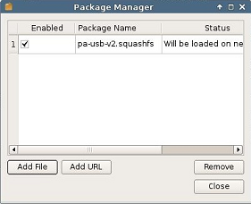

.. index::
   single: Packages
   
.. _packages-reference:

Manage Packages
---------------

In the upper toolbar of the Control Panel is a button that says **Manage
Packages** which opens the :index:`Package Manager`. This tool can be used to
enable or disable individual update packages that may be made available,
as well as customization packages provided by Lenovo. These packages
will be in a squashfs file type.

There are two methods of locating the files to be added to the list of
available packages. They can be added locally using the **Add File**
button, or they can be added from a remote location by clicking the
**Add URL** button.

To add an update package locally:

1. Click on the **Add File** button in the LeTOS Package Manager.

    .. figure:: media/image037.png
      :alt: Add File with Package Manager
        
2. Navigate to the location of the update package on the system or on a
   USB key and select **Open**. The USB key will typically be found
   within the **/media/** folder.

    .. figure:: media/image038.png
      :alt: Locating the **/media/** folder

.. raw:: LaTeX

     \newpage
	  
The package selected will now appear in the Package Manager menu. In
order to add a package that is stored on a server:

1. Click on the **Add URL** button in the Package Manager.

2. Enter the complete URL for the location of the update package, using
   an FTP, HTTP, or HTTPS protocol.

3. If necessary, enter the **Username** and **Password** needed to
   access the location where the file is held.

4. Click **Ok** after all the information needed has been entered.

The package will now appear in the Package Manager menu.

Newly added update packages will default to the **Enabled** status. In
the Package Manager, clicking the checkbox next to a file in the table
under the **Enabled** column will toggle it between being enabled or
disabled. Any changes to this status require a reboot before they will
take effect.

In order to completely remove a package:

1. Select the file you wish to remove from the table.

2. Click the **Remove** button.

3. A prompt will appear to ensure that this is the action that will be
   taken. Click **Confirm** to continue, or **Abort** to back out of
   the process.

Once **Confirm** has been clicked, the package will be deleted. For this
change to become permanent, the terminal will need to be rebooted. Packages 
are not removed if a thin client's local storage is cleared.

.. raw:: LaTeX

     \newpage