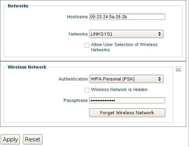

.. index::
   single: Networks

Network Settings
----------------

By default, the thin client attempts to contact a DHCP server on the
network during boot up. If there is a DHCP server, then the thin client
will acquire an IP address automatically and no further network
configuration is require. However, there are additional options
available.

Thin clients capable of connecting to wireless networks will still
default to a wired connection, if one is available and an Ethernet cable
is plugged in. To establish a wireless network connection, an Ethernet
cable cannot be attached to the thin client. To change the network for
the connection:

1. Open the **Thin Client Control Panel** from the **Start** menu.

2. Select the **Network** settings on the left-hand side of the
   **Thin Client Panel** under the **System** settings.

3. Select the desired connection from the **Networks** menu in the 
   **Networks** section. Remember that for wireless network connections,
   the Ethernet cable cannot be plugged in to the thin client.
   
4. If a wireless network is selected, a **Wireless Network** section
   will appear beneath the **Networks** section.

5. To further configure a wireless connection, select the
   authentication method used on the network from the
   **Authentication** dropdown menu. Depending on the authentication
   method selected, additional information may need to be entered into
   the fields that appear.

6. When all the required fields have been filled, click **Apply**.

7. The **Allow User Selection of Wireless Networks** option may be
   enabled after a wireless connection has been correctly configured in
   the Control Panel. With this option selected, the **Network** tray
   icon will allow established access points to be chosen from outside
   of the Control Panel.

8. To connect using the tray icon, right click on the **Network** tray
   icon in the lower left corner of the desktop. Select from the list
   of available networks. If a password or security key is required, a
   **Password** field will appear. When finished, click **OK** to
   connect.
   
   .. NOTE::
      For WEP connections, the standard passphrase cannot be used for authentication. Instead, the WEP hex key must be used as the passphrase for a successful connection.
   
To set a Static IP address on a LeTOS thin client:

1. Open the **LeTOS Control Panel** from the **Start** menu.

2. Select the **Network** settings on the left-hand side of the
   **Control Panel** under **System**.

3. Expand the **IP Configuration** section of the **Network Settings**
   menu.

4. Deselect the **Use DHCP** checkbox.

5. Type in appropriate values for in the address fields if needed and
   then press **Apply**. It may take a few moments to reconfigure to the
   Static IP.

6. To make any changes to the Host Name, or to add or edit the DNS
   servers, edit the **Hostname** field in the **Networks** area found
   near the top of the window. Press **Apply** when finished to save.

7. Changes to the Network settings may take a few moments, depending on
   the network speed. This is normal and the thin client will not need
   to be rebooted for the changes to take effect.

Support is also available for users who wish to use the 802.1X protocol for wired 
network connectivity. Certain options may require a certificate to progress. To 
set up a thin client for 802.1X connectivity:

1. If a certificate is needed, the the correct certificates will need to be
   applied through the **LTM Management Appliance**. Open a web browser and 
   browse to the address for the **LTM Management Appliance**. If the thin 
   client is not currently managed, it will need to be set to be managed by 
   this server. Open the Certificates page and upload all of the correct 
   certificates that the 802.1X connection requires.
2. Return to the Devices page to display the thin client inventory. Select all 
   of the thin clients that will be using an 802.1X connection. Open the gear-shaped 
   Action Menu and **Apply** the **Certificates** to the thin client(s). A reboot is 
   not required.
3. Return to the **LeTOS Control Panel** and open the **Network** settings. Select a 
   **Wired** network connection. This will display the option to use an 802.1X connection. 
   Click on the *Enable 802.1X* checkbox to enable the protocol. A series of 
   **Network Security** options will display. Select the correct *EAP method* from 
   the dropdown menu. The appropriate *CA Certificate* and *Client Certificate* 
   may be selected from the respective dropdown menus, if they are necessary. 
   Finally, enter any credentials that the connection may require. When finished, 
   click on the **Apply** button to save all changes made.

Users who wish to use a SCEP server have the option to do so as well. Enabling
SCEP support must be done through LTM. For instructions on how to enable SCEP,
refer to the **LTM Administrator Guide**.

.. NOTE::
   LeTOS only supports the Windows Server implementation for SCEP. Consult a
   Network Administrator for more information.

The device must connected to an unsecured network before attempting to use
SCEP. Once the SCEP server address has been sent to the device from LTM, 802.1X
will be configured, overwriting any previous configuration. The LeTOS Agent
will generate a certificate request from the SCEP server. Once SCEP is deployed
with all relevant information, connect the device to the secure 802.1X port.

.. NOTE::
   Multiple applications of SCEP will not apply. Clear Local Storage to set a
   new SCEP configuration.
   
.. raw:: LaTeX

     \newpage
