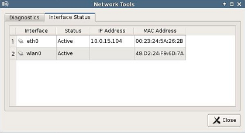

.. index::
   single: Networks

Network Tools
-------------

The toolbar along the top of the Control Panel window contains a button
named **Network Tools**. Clicking this button will open a separate,
smaller window that provides the current network status and useful
diagnostic programs.

Interface Status
~~~~~~~~~~~~~~~~

Click the **Interface Status** tab along the top of the **Network
Tools** window to view the IP address that is currently assigned to this
thin client. The MAC Address for this machine is also reported on this
screen.

Diagnostics
~~~~~~~~~~~

If there is difficulty connecting to servers on certain segments of the
LAN, then the ping command is available to verify that specific servers
and/or gateways on the subnet are being reached. To use ping:

1. Select the **Diagnostics** tab from the **Network Tools** window.

2. In the **Host Address** field, type in the IP address or website to
   test against and then press the **Ping** button.

3. If there is an error in the delivery to the destination, the ping
   command displays an error message. Otherwise, replies will
   continuously display for each packet successfully sent and received.

4. Press the **Stop** button to terminate the ping loop.