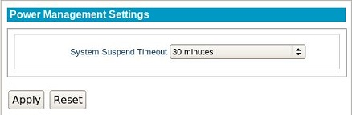

.. _powermanagement-reference:

Power Management
----------------

.. index::
   single: Power Management
   
LeTOS includes Energy Star-compliant power saving options. When enabled, the 
system will enter a suspended mode after a set duration of inactivity. The 
system can be woken up again at the press of a button on the keyboard.

.. NOTE::
    Mouse movement or clicking will not wake up the system. 

System Suspend Timeout
    Selecting one of the options from this menu will select the when the system
    enter suspend mode after a set period of inactivity. Selecting **Off** will
    prevent the system suspend from occurring.
    
.. raw:: LaTeX

     \newpage   