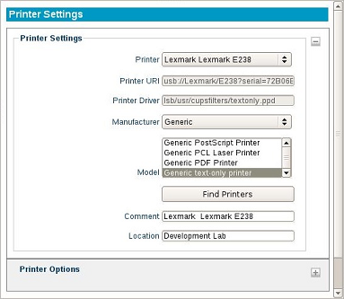

.. index::
   single: Printers

Printer Settings
----------------

LeTOS supports redirected printing to a locally attached USB printer.
Once the Printer Settings are properly configured and applied,
redirected printing will be enabled for all connections created on the
thin client that support the feature.

1. Open the **LeTOS Control Panel** from the **Start** menu.

2. Click the **Printer** settings on the left-hand side of the
   **Control Panel**, under **System**.

3. Click on the **Add** button to add a new printer. This will allow
   the printer to be named. Do not include spaces in this printer name.

4. Enter the following values for **Printer Settings**:

   Printer
       This menu will display multiple printers, if there is
       more than one printer plugged into the thin client. Select the
       printer that will be configured with these settings. If only one
       printer is available, that will display instead.

   Printer URI
       This field will self-populate with information
       provided by the printer. If a printer is connected while this
       menu is open but is not displaying, click on **Find Printers** to
       make it show up in this dropdown menu.

   Printer Driver
       This field will fill itself out once a printer
       has been selected and **Apply** has been clicked.

   Manufacturer
       This drop-down menu will contain a list of
       support printer manufacturers, making it easier to locate the
       drivers needed.

   Model
       Select the model of the printer from the list, based on
       the selected printer manufacturer.

   Find Printers
       Clicking on this button will allow LeTOS to
       populate fields based on the printer that is currently plugged
       in.

   Comment
       This allows a comment regarding the printer to be
       entered.

   Location
        A comment regarding the location of the printer can be
        entered, if necessary.

   Default Printer
        The current printer will be set as the default
        printer.

   Copies
        This will have the printer print multiple copies of a
        document, if desired.

5. Press the **Apply** button to save. The printer changes will take
   place immediately. No reboot is required.

6. Launch any of the local connections to begin utilizing these printer
   settings.

.. raw:: LaTeX

     \newpage   