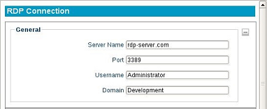
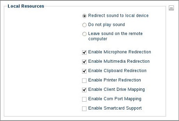

RDP
---

The General Section
~~~~~~~~~~~~~~~~~~~

The first section displayed for an RDP® session, is named General. This
form panel will already be expanded.

Server Name
    Enter the hostname or IP address of the server.

Port
    Enter the port number used in this connection.

User Name
    Specifies the name of a user account to log in as.
    This is optional.

Domain
    Specifies the domain to log on to.

The Display Section
~~~~~~~~~~~~~~~~~~~

Operate in full screen mode
    The RDP® session will take up the
    entire display and will not allow minimization.

Use All Monitors
    If a multi-monitor setup is being used, then enabling this option 
    will allow the RDP session to display on all monitors.

Operate in maximized window mode
    This option will display the
    session in a window. This window will allow minimizing and maximizing.

Use specified screen size
    The session will launch in a fixed sized
    window, specified by the dimensions chosen in the dropdown list below.
    This window can only be minimized, the fixed size is the maximum size
    allowed.

Color depth for this connection
    Select the desired color depth for
    this session.

.. raw:: LaTeX

     \newpage
	
The Local Resources Section
~~~~~~~~~~~~~~~~~~~~~~~~~~~

Sound Redirection Options
    By default, sound from the server will
    redirect to the local thin client. If no sound is to be sent to the
    local device, then select either the **Do not play sound** or **Leave
    sound on the remote thin client** radio buttons.

Enable Microphone Redirection
    Enabling this option will allow a
    microphone to be used within the session, if the desktop supports audio
    input.

Enable Multimedia Redirection
    This option allows multimedia devices
    to be used within the session.

Enable Clipboard Redirection
    This option will allow items on the
    local desktop’s clipboard to be carried over to this desktop session.

Enable Printer Redirection
    Mark this checkbox to redirect printing
    to a printer attached the local terminal. The name of the printer will
    need to be provided.

Enable Client Drive Mapping
    Allows the user plug USB Flash Drives
    locally into the terminal and access the contents of the drive via the
    RDP® session.

Enable Com Port Mapping
    Redirects serial devices on the thin client
    to the server.

Enable Smartcard Support
    Specifies whether redirection of Smart
    Cards is permitted during server authentication.

.. NOTE::
    To correctly set up Printing, make sure the printer’s name matches what has 
    been assigned in the **Control Panel**. This can be found in the 
    **Printer** section, under **System Settings**.

The Start a Program Section
~~~~~~~~~~~~~~~~~~~~~~~~~~~

Program path and filename
    Specifies the path of the application
    on the server to be automatically launched when the connection is
    made. This will launch the application in a window within the local
    desktop.

Working Directory
    Specifies the working directory used for the
    application.

.. raw:: LaTeX

     \newpage
	
The RD Gateway Section
~~~~~~~~~~~~~~~~~~~~~~

RD Gateway Usage
    Select whether RD Gateway will be used for
    this session, if it is available. The options available are **Do not
    use**, **Always use**, **Only if direct connection cannot be made**,
    or **Use default settings**.

RD Gateway Host
    Enter the hostname for the RD Gateway server.
    Users may choose to **Reuse RD Gateway Credentials** if they wish to
    reuse their RD Gateway credentials to log in to the server as well.

RD Gateway Credential Source
    This option selects the method in
    which the RD Gateway server will be accessed. Users may **Ask for
    permissions (NTLM)**, **Use smart card**, or **Select later** if
    they can not or do not want to specify.

RD Gateway Profile Method
    Specifies the working directory used
    for the application. Users may choose to **Use default profile
    method** or **Use explicit settings**.

The RemoteApp Section
~~~~~~~~~~~~~~~~~~~~~

Users may select from a **Normal Session** for a standard connection
or a **RemoteApp Session** to enable the RemoteApp services.

Disable RemoteApp Support Checking
    This option may be used to
    bypass a check for RemoteApp support on a server. Disabling the
    support check is recommended for servers running older versions of
    Windows®.

Application Name
    The executable name of the application to be
    used.

Application
    The location of the application. Drive redirection
    may need to be enabled in order for local files to open properly.

Command Line
    Parameters to launch the application with. This is
    optional.

Expand Commandline
    If parameters have been entered in the
    **Command Line** field, then this option may be enabled so that any
    environment variables can be expanded to include the values of the
    remote desktop. Optionally, disabling this option will only expand
    the values of the local desktop.

Expand Working Directory
    Enabling this option will expand any
    environment variables in RemoteApp’s shell working directory to the
    remote desktop. Leaving this option disabled will only expand the
    values of the local desktop.

.. raw:: LaTeX

     \newpage
	
The Performance Section
~~~~~~~~~~~~~~~~~~~~~~~

Experience Options
    These various settings can be enabled or disabled to suit the user 
    experience desired. These options may affect the performance of 
    networks, so users with poor connectivity may wish to disable these 
    options. 

Enable bitmap caching
    This option will allow common .bmp-based
    images from the session desktop to be stored on the local hard
    drive. Selecting this option may improve connection performance.

Disable cursor from blinking
    Indicates that *cursor blinking*
    should be disabled during the session.

Enable window manager's key bindings
    By default RDP® attempts
    to grab all keyboard input when it is in focus.

Attach to the console of the server
    The session will connect to
    the console of the server (requires Windows® Server 2003 or newer).

Enable RemoteFX
    Toggles whether or not the connection will use
    the RemoteFX® feature.

Enable font smoothing
    This will enable ClearType for the RDP session, making font appear 
    smooth and more clear.	
	
The Options Section
~~~~~~~~~~~~~~~~~~~

Enable compression of the RDP DataStream
    In an environment where system and client resources are not capable, data compression
    can be used to decrease the amount of data that must be sent across
    the network.

Autostart
    Enable this checkbox to automatically launch this
    session after the thin client completes its boot procedure.

Auto Restart
    Select **Yes** or **Prompt** to automatically
    restart the connection.

    - **Yes** - Once the session is terminated, the session will automatically restart. There is no way for the user to stop it from occurring.
    - **Prompt** - When the session is terminated, the user will receive a **YES/NO** prompt asking them if they wish to reconnect to the session.

Disable Desktop
    This option disables desktop access, ensuring that only this connection is 
    accessible. Logging off from the server will power off the thin client, and 
    powering on the thin client will bypass the operating system's desktop and 
    immediately log in to the server. To revert this option, an LTM administrator 
    will need to push to the thin client a connection that does not have this 
    feature enabled. Once the connection has been pushed, reboot the thin client.
    
    .. CAUTION::
        Be mindful of auto-restart usage, to avoid cases where a session will relaunch when disable desktop is no longer needed.

Enable CredSSP
    This enables the Security Support Provider for the server. 
    This option is enabled by default.	

.. raw:: LaTeX

     \newpage