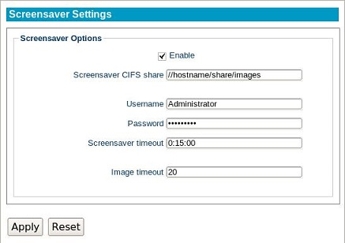

.. _screensavers-reference:

Screensaver
-----------

.. index::
   single: Screensaver
   
A screensaver can be set using images that are available within a Windows Share
directory. This will cycle through a series of images after a set duration of
inactivity.

   
Enable
    Selecting this checkbox will enable the screensaver feature. This will
    override any Blank Time or Suspend Time settings that were established inactivity
    the Display module.

Screensaver CIFS share
    Enter the CIFS share directory containing the images that will be used for
    the screensaver. Supported image types are `.jpeg`, `.png`, and `.gif`.

Username
    Specifies the name of a user account that will access the server.
    
Password
    Enter the password for the user account being used.
    
Screensaver timeout
    The idle time before the screensaver begins, set to **hh:mm:ss**.
    
Image timeout
    The time, in seconds, that an image will remain on screen before cycling to
    the next available image on the server.

.. raw:: LaTeX

     \newpage   