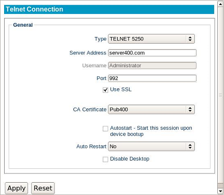

Telnet
------

The following section describes the basic steps for establishing a Telnet
connection.

The General Section
~~~~~~~~~~~~~~~~~~~

Type
    Select the type of Telnet connection being run. Certain types may have
    different security restrictions.

Server Name
    Enter the hostname or IP address of the server.

Username
    Specifies the name of a user account to log in as.
    This is optional.

Port
    Enter the port number used by this connection.

Use SSL
    Enable or disable the use of SSL. The port number will automatically change
    depending on the status of this option.    

CA Certificate
    Depending on the Telnet connection type that is being run, a certificate
    may be required to progress. For more information on uploading certificates
    to the device, refer to the LTM Administration Guide's Certificates section.

Autostart
    Enable this checkbox to automatically launch this
    session each time the thin client completes its boot procedure.

.. raw:: LaTeX

     \newpage   
    
Auto Restart
    Select **Yes** or **Prompt** to automatically
    restart the connection.
  
    - **Yes** - Once the session is terminated, the session will 
      automatically restart. There is no way for the end-user to 
      stop it from occurring every time it closes.
    - **Prompt** - Once the session is terminated, the user will receive 
      a **YES/NO** prompt asking them if they wish to reconnect to the session.

Disable Desktop
    This option disables desktop access, ensuring that only this connection is 
    accessible. Logging off from the server will power off the thin client, and 
    powering on the thin client will bypass the operating system's desktop and 
    immediately log in to the server. To revert this option, an LTM administrator 
    will need to push to the thin client a connection that does not have this 
    feature enabled. Once the connection has been pushed, reboot the thin client.
    
    .. CAUTION::
        Be mindful of auto-restart usage, to avoid cases where a session will relaunch when disable desktop is no longer needed.    
 
.. raw:: LaTeX

     \newpage	