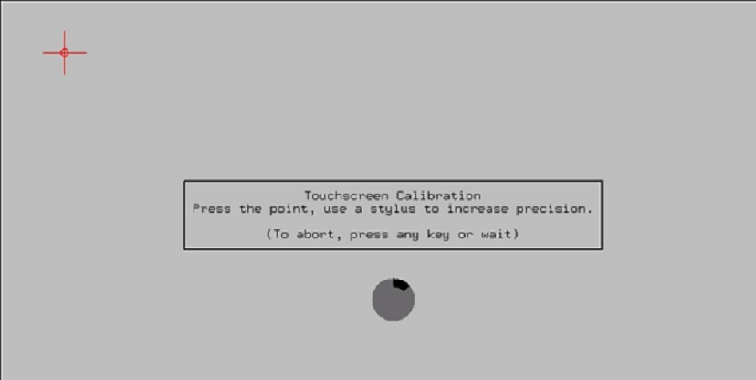

.. index::
   single: Display

Touch Screen Support
========================

Upon connecting a touch screen to the thin client, a calibration
screen will be presented on first boot to ensure the unit functions
properly.

There are two ways to calibrate the touch screen device when
attached to the thin client.

.. raw:: LaTeX

     \newpage

Calibration – Option 1
----------------------

Upon first boot of the operating system, a calibration screen with a
countdown timer in the middle will display if a touch screen device is 
detected.

1. Use a finger or a stylus to tap the center of the red cross that
   displays. Try to get as close as possible to the small circle in
   the center of the red cross.

2. Another calibration spot will appear. Repeat the process for the
   calibration spots that appear on the screen.

.. NOTE::
    If the calibration is inaccurate, the calibration tool will ask to re-try the process until a more accurate reading is achieved. To cancel the dialog at any time, either wait out the calibration time given or press any key.

3. Once the Touch Screen is calibrated, the desktop will display as
   normal.

Calibration – Option 2
----------------------

The second method of calibrating the hardware can be found in the LeTOS
desktop, where a **Calibrate Touchscreen** icon is available.

Follow the steps from **Option 1** to calibrate the touch screen.

.. NOTE::
    There is currently no way to configure the calibration of an individual device and push that setting via the Management Console software. Re-imaging or updating the thin client will require the device to be re-calibrated. If at any time the calibration seems inaccurate, a mouse can be plugged in and an attempt to re-calibrate the device can be performed.

.. raw:: LaTeX

     \newpage	