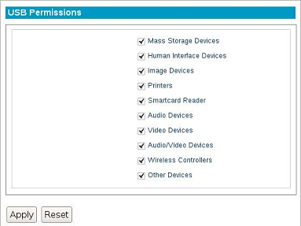

.. index::
   single: USB Devices

USB Permissions
---------------

This section allows USB external devices to be enabled or disabled for
use on the thin client.

1. Open the **LeTOS Control Panel** from the **Start** menu.

2. Click the **USB Permission** settings on the left-hand side of the
   **Control Panel** under **System**.

3. Click on a check mark to allow or restrict the level of access that
   a USB device may have within the operating system. By default, all
   options are given full permission.

    .. CAUTION::
         Be sure to understand what each USB option associates itself with. Disabling **Human interface Devices**, for example, will disable USB keyboards and mice. This situation is ideal for hardware that supports PS/2 input devices.

4. Press the **Apply** button to save. Changes will take place
   automatically.

.. raw:: LaTeX

     \newpage