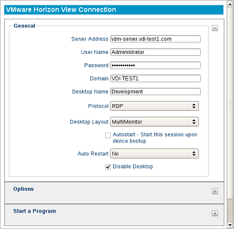

VMware Horizon View
-------------------

The VMware Horizon View client allows you to connect to a VMware server,
which in turn, provides the end-user with their own virtual desktop
session. The following section describes the basic steps for configuring
the View Client.

The General Section
~~~~~~~~~~~~~~~~~~~

Server Address
    Enter the Hostname or IP address of the VMware
    Horizon View Broker.

Credentials
    Specify the User Name and Password of the default
    user account.

Domain
    Specifies the domain to log on to.

Desktop Name
    The name of the desktop can be entered if a
    connection should always be made to the same desktop. If the
    field remains empty, then the user may be prompted to select an
    available desktop upon connecting to the server.

Protocol
    Choose whether to connect to the server using the PCOIP, RDP, or BLAST
    protocol.

Enable background on startup
    Selecting this option will cause the client to expand to fullscreen 
    and lock the desktop layout to a single monitor, fullscreen display.

Desktop Layout
    Choose the desktop option that best suits the display setup. If 
    **Enable background on startup** is selected, this will lock to 
    a single monitor, fullscreen display.

Autostart
    Enable this checkbox to automatically launch this
    session after the thin client completes its boot procedure.
	
.. raw:: LaTeX

     \newpage

Auto Restart
    Select **Yes** or **Prompt** to automatically
    restart the connection.

   - **Yes** - Once the session is terminated, the session will automatically restart. There is no way for the user to stop it from occurring.
   - **Prompt** - Once the session is terminated, the user will receive a **YES/NO** prompt asking them if they wish to reconnect to the session.

Disable Desktop
    This option disables desktop access, ensuring that only this connection is 
    accessible. Logging off from the server will power off the thin client, and 
    powering on the thin client will bypass the operating system's desktop and 
    immediately log in to the server. To revert this option, an LTM administrator 
    will need to push to the thin client a connection that does not have this 
    feature enabled. Once the connection has been pushed, reboot the thin client.
    
    .. CAUTION::
        Be mindful of auto-restart usage, to avoid cases where a session will relaunch when disable desktop is no longer needed.

The Options Section
~~~~~~~~~~~~~~~~~~~

Disable Menubar
    When this option is enabled, the VMware Horizon View menu bar will be hidden 
    from the desktop.

Run Once (Exit on Disconnect)
    This will close the VMware Horizon View client completely upon logging out 
    or disconnecting from the server, rather than returning users to the 
    desktop selection options of the client.

Enable kiosk login mode
    Enabling this option will have VMware use a kiosk-based login mode. This 
    option must also be enabled within the server environment.

Lock the server URL field
    This option prevents users from changing the server or selecting a 
    different server from the client's server selection menu. 

The Start A Program Section
~~~~~~~~~~~~~~~~~~~~~~~~~~~

Application Name
    Enter the name of the application that will be run upon server login. 
Application Size
    Choose the option that best suits the display setup and the application 
    that will be used. If **Enable background on startup** is selected, this 
    will lock to a single monitor, fullscreen display. 

.. raw:: LaTeX

     \newpage	
	
Troubleshooting Tips for VMware Horizon View Connection
~~~~~~~~~~~~~~~~~~~~~~~~~~~~~~~~~~~~~~~~~~~~~~~~~~~~~~~

+ If the session is set to full screen but the display covers only a
  fraction of the entire screen, then the allocated RAM for the
  virtual desktop may need to be set a little higher.

+ If certain features like foreign key maps, CD-ROM, USB stick, or
  printer redirection are not passing through to the virtual desktop
  session, check if the VM is at the correct version. The latest agent
  software executables can be downloaded at VMware's website at:
  http://www.vmware.com/downloads.

+ If USB flash drives are to be used within the session, it is best to
  use sticks formatted in FAT or NTFS. Long delays sometimes occur
  when using flash drives formatted in FAT32. Other USB
  troubleshooting tips can be found at the following VMware site:
  http://kb.vmware.com/kb/1026991.

.. raw:: LaTeX

     \newpage  