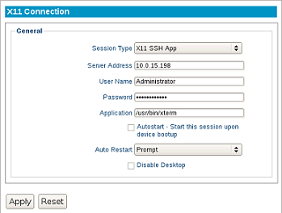

X11 Connection
--------------

The X11 client allows a connection to an X11 server, which provides the
user with their own virtual desktop session. The following section
describes the basic steps for configuring the X11 connection.

Session Type
    Choose from the single **SSH App** type or the
    **XDMCP** connection.

Server Address
    Specify which IP address is the X11 server.

Credentials
    For **XDMCP** sessions, specify the User Name and Password of the default
    user account.

Application
    For **SSH App** sessions, this is the file path needed to launch a single
    application.

Resolution
    Choose the resolution for your connection, ranging
    from full screen to various fixed resolutions.

Autostart
    Enable this checkbox to automatically launch this
    session after the thin client completes its boot procedure.

Auto Restart
    Select **Yes** or **Prompt** to automatically
    restart the connection.

    - **Yes** - Once the session is terminated, the session will automatically restart. There is no way for the user to stop it from occurring.

    - **Prompt** - Once the session is terminated, the user will receive a **YES/NO** prompt asking them if they wish to reconnect to the session.

Disable Desktop
    This option disables desktop access, ensuring that only this connection is 
    accessible. Logging off from the server will power off the thin client, and 
    powering on the thin client will bypass the operating system's desktop and 
    immediately log in to the server. To revert this option, an LTM administrator 
    will need to push to the thin client a connection that does not have this 
    feature enabled. Once the connection has been pushed, reboot the thin client.
    
    .. CAUTION::
        Be mindful of auto-restart usage, to avoid cases where a session will relaunch when disable desktop is no longer needed.

.. raw:: LaTeX

     \newpage