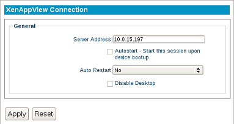

XenApp View
-----------

The following section describes the basic steps for configuring the XenAppView 
connection.

Server Address
    Enter the URL of the Citrix XenApp server.

Autostart
    Enable this checkbox to automatically launch this session
    after the thin client completes its boot procedure.

Auto Restart
    Select **Yes** or **Prompt** to automatically restart the connection.

   - **Yes** - Once the session is terminated, the session will automatically restart. There is no way for the user to stop it from occurring.
   - **Prompt** - Once the session is terminated, the user will receive a **YES/NO** prompt asking them if they wish to reconnect to the session.

Disable Desktop
    This option disables desktop access, ensuring that only this connection is 
    accessible. Logging off from the server will power off the thin client, and 
    powering on the thin client will bypass the operating system's desktop and 
    immediately log in to the server. To revert this option, an LTM administrator 
    will need to push to the thin client a connection that does not have this 
    feature enabled. Once the connection has been pushed, reboot the thin client.
    
    .. CAUTION::
        Be mindful of auto-restart usage, to avoid cases where a session will relaunch when disable desktop is no longer needed.

.. raw:: LaTeX

     \newpage
	 
Connecting to Citrix Storefront
~~~~~~~~~~~~~~~~~~~~~~~~~~~~~~~
A certificate, provided by the Domain Certificate Authority or a Trusted Root 
Certificate Authority, will need to be pushed to the thin client in order to 
have a secure connection to Citrix Storefront.

1. On a separate PC or device, open a web browser (Internet Explorer recommended) 
   and connect to the Receiver Storefront web page.
   Locate the Certificate information and copy the certificate or certificates within 
   the certification path. When saving each certificate, select the button for the 
   Base64 encoded X.509 certificate file (.CER), and then save each certificate file in 
   any preferred location.
2. Browse to the address for the **LTM Management Appliance**. If the thin client is not 
   currently being managed, it will need to be set to be managed by this server. Open 
   the Certificates page and upload all of the certificates that were downloaded in the 
   previous step.
3. Return to the Devices page to display the thin client inventory. Select all of the 
   thin clients that will be accessing the Citrix Storefront. Open the gear-shaped 
   Action Menu and **Apply** the **Certificates** to the thin client(s). A reboot is not 
   required.
4. On the LeTOS device(s), create a XenAppView connection that uses a Citrix Storefront 
   address (ex.: :code:`citrixstorefront.domainname.com/citrix/store`). The 
   connection will be now be secure.