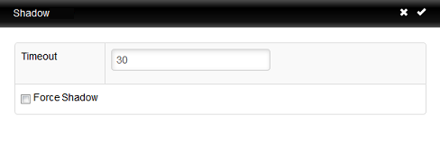

.. _shadow-reference:

Shadow
------

.. index::
   single: Shadow

Administrators have the option to Shadow thin clients. With this feature, 
any Administrator or User account with approved permissions can remotely shadow 
a device, allowing interaction with the host unit that is being shadowed.

Before Shadowing can be permitted, the following settings will need to be 
established within the Management Appliance: 

   +  **Number of Sessions:** The number of shadowing sessions that the server 
      allow at one time. This can be adjusted based on the network.
   +  **Initial Client Port:** The client port opened for Shadow.
   +  **Initial Server Port** The server port opened for Shadow.

Furthermore, the following ports will need to be opened in order to successfully
Shadow a device: 

   +  **Ports 5500-5509:** This needs to be opened to allow device-to-server communication.
   +  **Ports 5999-6008:** This needs to be opened to allow web-to-server communication.
   
To Shadow a device: 

#. From the **Devices** inventory table, select the device that will be 
   shadowed. Only once device can be shadowed at a time.

#. Click the **Options** button at the top of the inventory panel. In
   the dropdown menu, choose the **Shadow** option.

#. A **Shadow** dialogue box will open with a couple of options:

   -  **Timeout** - The amount of time given for the Shadow session to 
      register to the host device. If this time expires before a connection is 
      made, the Shadow session will not begin. This is also the amount of 
      time needed before a new shadow session can be started on the device.

   -  **Force Shadow** - This option prevents a prompt from displaying on 
      the host device that allows the host user to confirm or deny the 
      Shadowing session. Instead, the host will be immediately informed that 
      they are being shadowed.

#. Click the checkmark in the top right corner of the **Shadow** dialogue 
   box to start the shadowing session. A new window or tab will appear. If the 
   host has approved the session, or if **Force Shadow** is enabled, then   
   the desktop of the device will display. The device can now be interacted with.

.. raw:: LaTeX

     \newpage   