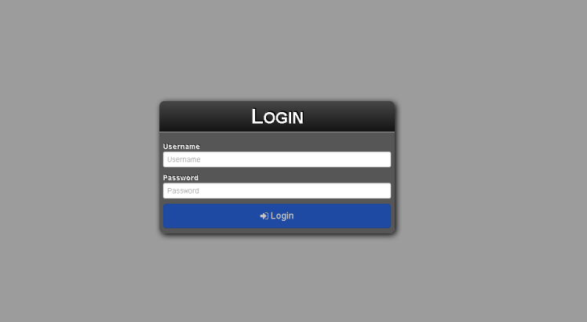

Check Connectivity
------------------

Using a web browser, enter the server address into the web browser address bar. A
security warning may need to be bypassed to access the login page. The
server can be added as a “Safe Site” to avoid security warnings in the
future. If the installation and setup was performed successfully, the
**Login** screen will display.

Troubleshooting a Bad Connection
~~~~~~~~~~~~~~~~~~~~~~~~~~~~~~~~

Make sure that the appliance has network connectivity and that data
packets can flow to and from the appliance. To access different virtual
terminals, press and the right arrow key. Once at the terminal prompt,
the following will be visible::

    ws-broker login:

Log in using the username **bwadmin** and the password, which was set
during the initial configuration of the appliance. Test network
connectivity by pinging remote machines to ensure the appliance can see
machines on the network. Also ping the appliance from a thin client to
make sure the device can see the server.

If the server is not responding to any pings that are sent out or
received, double-check the network settings and make sure that port
50000 is open on the network.

.. raw:: LaTeX

     \newpage