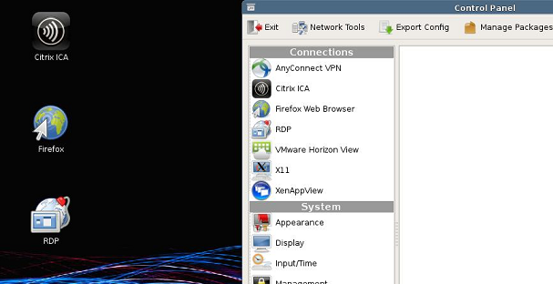

Cloning Connections
-------------------

Administrators are able to clone individual connections from a thin
client and save them in the Management Appliance database.
Administrators can easily create a desktop connection on a device and
then propagate it to all of their other devices via a profile. All
connections can be cloned, and the most common are listed below:

-  **RDP** - One or more **.rdp** configuration files used for connecting
   to Microsoft® Terminal Servers.

-  **ICA** - One or more **.ica** configuration files used for connecting
   to Citrix servers.

-  **XenAppView** - Another option for accessing Citrix servers.

-  **VMware** - The connection settings and configurations for the
   Horizon View client.

-  **Firefox®** or **Internet Explorer®** - The local web browser and its
   starting URL.

-  **AnyConnect® VPN** - Establishes a VPN connection.

-  **NX** - Allows connectivity to a NoMachines session.

-  **X11** - The settings and configurations for an X11 server or
   application.

How to Clone Connections
~~~~~~~~~~~~~~~~~~~~~~~~

#. From the table of inventoried devices, select a device to clone
   connections from and then click on the **Options** button at the top
   of the inventory table.

#. In the dropdown menu, go to **Clone** and click on **Connections**.

#. A **Clone Connections** dialogue box will open with a field entitled
   **Connections**.

#. Click on the **Connections** field to view a dropdown list of the
   connections currently available for cloning from that device. Select
   one or several of the connections listed.

#. Click the checkmark in the top right corner of the **Clone
   Connections** dialogue box to create the clone.

#. The **Connections** tab will display the recently cloned connection
   entries in the inventory table.

.. raw:: LaTeX

     \newpage

   
Applying Connections to a Device
~~~~~~~~~~~~~~~~~~~~~~~~~~~~~~~~

#. From the table of inventoried **Devices**, left-click on the checkbox
   to the right of a device to select it.

#. Click on the **Options** button at the top of the inventory table.

#. In the dropdown menu, go to **Apply** and click on **Connections**.

#. In the **Apply Connections** dialogue box, select which connections
   to apply by clicking in the **Connections** field and selecting from
   the options that are displayed. To select multiple connections,
   simply choose another from the dropdown menu and it will be added to
   the list.

#. Click the checkmark in the top right corner of the **Apply
   Connections** dialogue box to apply the desired connections to the
   device.

.. NOTE::
   There are a few differences in the way VMware Horizon View
   client connections are handled by Windows®-based systems, as compared to
   RDP and ICA connections. Only one VMware Horizon View client connection
   can exist per user. The configuration settings for a VMware Horizon View
   client connection are stored in the User account's registry hive, not in
   flat files like RDP and ICA. This is simply the nature of VMware's View
   client program and not in any way a limitation with the Management
   Appliance.

.. raw:: LaTeX

     \newpage