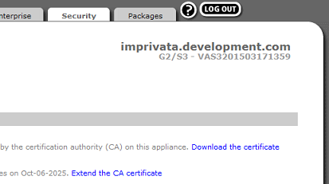

.. _imprivata-reference:

Imprivata
---------

.. index::
   single: Imprivata

Certain disk images support the use of Imprivata OneSign for one-touch sign-in
solutions. With OneSign, various single sign-on methods are available. Support
is included for proximity card readers.

Installing the Imprivata Package
~~~~~~~~~~~~~~~~~~~~~~~~~~~~~~~~

To begin using OneSign, a package will need to be installed on devices. The 
Management Appliance can be used to remotely install the package on multiple
devices.

1. Download the latest Imprivata package. Host it on an HTTP(S) or FTP server.
2. Open a web browser and enter the Management Server address. This will access
   the web appliance. 
3. From the **Devices** inventory page, verify that devices receiving Imprivata
   OneSign are powered on and connected to the Management Server, or to another
   Management Server that shares the database.
4. Open the Management Server **Settings**, located at the top of the web 
   interface page. Access the **Storage Locations** page. If necessary, click
   on the **+** sign and enter the server credentials to add the server to the
   list.
5. Return to the **Home** page and access the **Software** option, located on 
   the side of the page. An inventory of software packages will display. Click 
   on the **+** icon to add a new software package to the inventory. Enter all 
   of the required information in the fields presented. Enter the *Filename* 
   exactly as the file is stored on the server, including the file extension.
   From the **Storage Location** drop-down menu, select the server that is 
   storing the Imprivata package. When finished, click on the checkmark icon 
   to add the software package to inventory.
6. Go to the **Devices** inventory page. Select all the devices that will 
   receive the Imprivata package. Open the Options menu (shaped like a gear) 
   and select **Apply** from the menu. This will open up new options. Choose 
   the **Software** option.
7. Refer to the steps given in the :ref:`packages-reference` section. Follow
   the instructions given. The package can be set to install to devices 
   immediately or at a scheduled time. 
8. After installation, all devices that have received the package will need to
   reboot. Select all applicable devices and use the **Reboot Device** option 
   from the Options menu. After the reboot, an Imprivata module will be 
   available within the Control Panel.

Adding Certificates
~~~~~~~~~~~~~~~~~~~

Devices that will be using Imprivata OneSign may require a certificate to 
access servers. This certificate must be extracted from the Imprivata servers 
and installed to devices.

For more information, refer to the Imprivata server's documentation.

.. raw:: LaTeX

     \newpage
   
1. On a local machine, open a web browser and enter the Imprivata server 
   address. Internet Explorer 8.0 or above is recommended for this step. Use 
   Port 81 in the address to access the web interface.
   
   .. NOTE::
      The Imprivata Admin Console is only compatible with Internet Explorer 8.0
      and above. The Imprivata Appliance Console will work with most browsers.
   
2. A choice between the Admin Console and the Appliance Console will be present. 
   Select the **Appliance Console** and login with Administrator credentials.
3. Open the **Security** tab, located at the top of the screen. The SSL page
   will contain a `Download the certificate` link. Click on this link and 
   select the option to *Save* the certificate to the local disk. For other web
   browsers, right-click on the link and select "Save As..." to save the 
   certificate to the local disk.
   

   
4. Access the Web Application and open the **Certificates** inventory page. Add
   a new certificate to inventory. For more information on adding new 
   certificates, refer to the :ref:`Certificates` page.
5. Go to the **Devices** inventory page. Select all the devices that have 
   Imprivata OneSign and will need the Imprivata certificate. Open the Options 
   menu (shaped like a gear) and highlight **Apply** from the menu for new 
   options. Choose the **Certificates** option.
6. Select the Imprivata certificate from the drop-down menu. The certificate 
   can be set to install to devices immediately or at a scheduled time. Once 
   devices have installed the certificate, they are ready to run. A reboot is
   not necessary.

Enabling Imprivata
~~~~~~~~~~~~~~~~~~

Finally, enable Imprivata OneSign on devices. These are the steps to enable
OneSign through the Management Server.

1. Access the Web Application and open the **Imprivata** inventory page. Click
   on the **+** icon to add a new Imprivata configuration. 
2. Give the Imprivata configuration a name and customize the options available. 
   The "Enable" option will set OneSign to an enabled state once the 
   configurations have been applied. 

.. raw:: LaTeX

     \newpage   
   
3. Select one of the **Bootstrap type** options presented. The 
   **Bootstrap server address** will vary, depending on the **Bootstrap type**: 
   
   - **SRV**- The SRV record, based on the name set in the DNS. This record 
     will provide information to the bootstrap server that makes access easier,
     especially for larger installations. The record returned must be a 
     fully-qualified domain name of the bootstrap server, and not the DNS IP 
     address. It should match the address given in the Imprivata Admin Control 
     Panel.
   
   - **Server Address**- The fully-qualified domain name of the bootstrap 
     server. Like **SRV**, the **Bootstrap server address** is given in the 
     Imprivata Admin Control Panel. If `Require Valid SSL Certificate` is 
     disabled, the Alias CNAME may also be used.
     
     .. NOTE::
        For **Server Address**, if the `https://` is not included, it will be 
        included automatically. However, the system will not upgrade `http://` 
        to `https://`.
   
4. There is an option to make the client require a valid SSL certificate. This
   will ignore self-signed errors and hostname mismatch errors. If this option
   is enabled, an Imprivata certificate must be installed locally. This option
   is more secure and will not ignore any SSL errors if they occur.
5. An option is available to disable the device's desktop. This locks down the 
   kiosk for direct access to Citrix or VMware. After all the information has 
   been entered, click on the checkmark icon to create the Imprivata 
   configuration.

.. figure:: media/image40.png
   :alt: Imprivata
   
6. Go to the **Devices** inventory page. Select all the devices that will 
   receive the Imprivata configurations. Open the Options menu (shaped like
   a gear) and highlight **Apply** from the menu for new options. Choose the
   **Imprivata** option.
7. Select the Imprivata configuration from the drop-down menu. The Imprivata 
   configuration can be set to apply to devices immediately or at a scheduled
   time. Devices that have received the Imprivata settings will need a reboot
   to properly apply the settings.
   
.. raw:: LaTeX

     \newpage

Applying Imprivata through Profiles
~~~~~~~~~~~~~~~~~~~~~~~~~~~~~~~~~~~
     
Imprivata OneSign can be applied to devices through a profile. For more 
information on applying profiles, refer to the :ref:`profiles-reference`
section.

.. NOTE::
   Due to a known issue within LeTOS versions 1.2.4 and below, an error may
   appear during the initial boot after the profile is applied, stating `"An 
   error occurred contacting the server: Unknown Error. Please contact your
   administrator"`. Clicking **OK** will bypass this error and have OneSign
   operate as normal. 