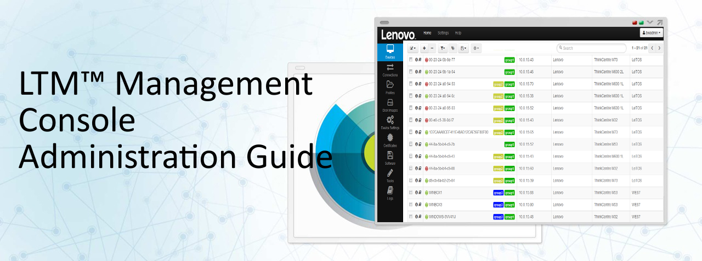

=====================================================
Lenovo Thin Client Manager (LTM) Administration Guide
=====================================================

.. NOTE::
   A NOTE indicates important information that helps to make better use of the product.

.. CAUTION::
   A CAUTION indicates potential damage to hardware or loss of data if instructions are not followed.

.. WARNING::
   A WARNING indicates a potential for property damage, personal injury, or death.

Information in this publication is subject to change without notice.

.. figure:: media/image4.png
   :alt:

©2017 Lenovo, All rights reserved.

Rev. 2017-09

.. toctree::
   :maxdepth: 2

   InstallationAndSetup.rst
   LearningBasics.rst
   DeviceManagement.rst
   ApplianceSettings.rst
   Terminology.rst
   Legal.rst

