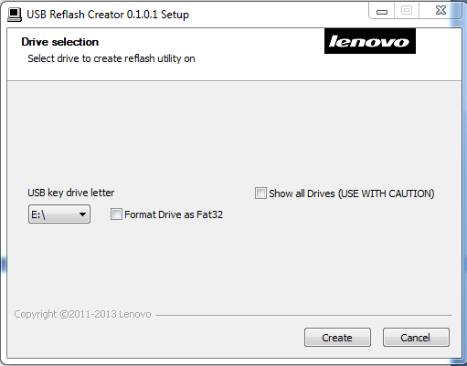
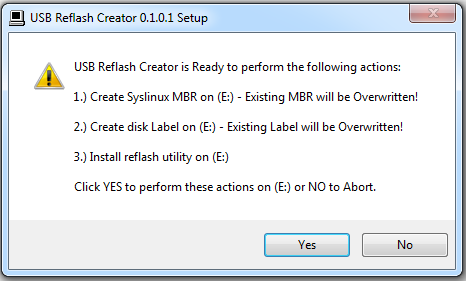

Creating the Reflash Utility on a USB Flash Drive
-------------------------------------------------

The Reflash Utility is distributed as an ``.exe`` executable file. This 
executable can be used to create a bootable USB key.

Once the EXE file has been downloaded, follow these steps to create a 
bootable USB key:

1.  Run the executable. If this is being run on a Windows machines, 
    this operation will need to be run on an account that has 
    Administrator privileges.
2.	Select the drive letter of the USB key from the dropdown menu.  If the 
    desired drive does not appear in the dropdown, click in the checkbox next 
    to **Show All Drives**.

    .. CAUTION::
       Selecting Show All Drives will populate the list with every available drive, including 
       the ``C:\`` drive.  Be cautious about selecting the desired drive before continuing.

3.	If the USB flash drive has not yet been formatted, then a reformatting will 
    need to be performed. Click the checkbox titled **Format**.  This will erase 
    everything present from the USB key. 
4.	Select Create. A dialog box will appear to confirm the changes you are making. 
    If all the information is correct, click Yes to proceed. This process may take 
    a few moments to complete. Once the process is completed, the **Close** button
    will be functional. Click on the **Close** button to complete the Reflash 
    Utility creation.

