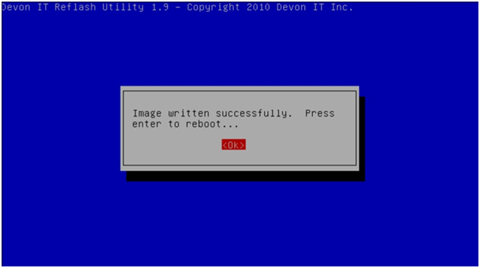

Final Steps
-----------

Once the re-imaging stage has completed, press ``Enter`` to reboot. Once the 
reboot process starts, the USB flash drive can be safely removed. Remove the 
flash drive to automatically boot into the DOM with the newly flashed image, or 
select the device's DOM from the boot menu. The thin client is now running the 
new disk image.

