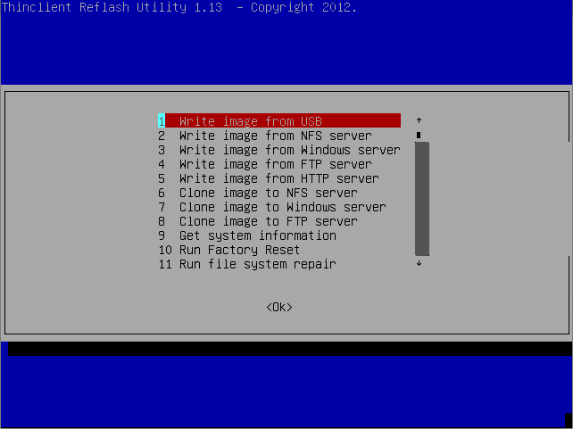
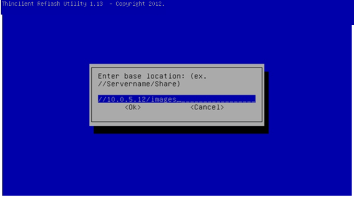
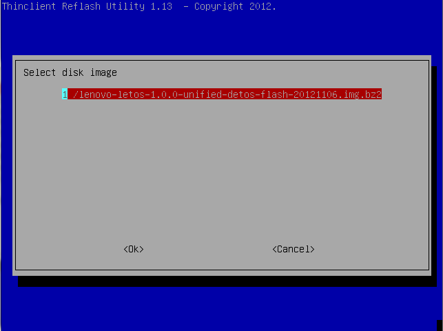
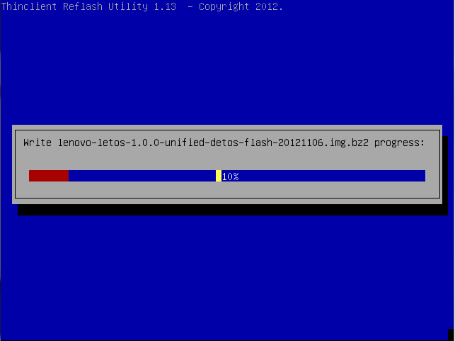

Writing to the Thin Client
--------------------------

Plug the USB key with Re-Imaging Utility into the thin client. To run the 
Re-Imaging Utility, you must ensure that your thin client is set to boot from 
the USB flash drive instead of the internal drive. 

To re-image a thin client using a USB flash drive:

#.	Press ``F12`` during bootup to access the system boot menu. 
#.	Select the second option called USB-HDD0 and press <Enter>. You will see a 
    menu with an option called Default selected. 
#.	Select the name of the desired image and press <Enter>.
#.	Select language in the Select a User Interface Language screen and hit <Enter>

After the bootup is complete the Lenovo Re-Imaging Utility Main Menu is displayed.

Use the arrow keys to select an option that corresponds to the way you saved your disk image.

•	If you copied your disk image directly to the USB flash drive, then select <1> and press <Enter>.
•	If you copied your disk image to an NFS mounted directory, then select <2> and press <Enter>.
•	If you copied your disk image to Windows Network drive, then select <3> and press <Enter>.

Writing the Local Image from USB
~~~~~~~~~~~~~~~~~~~~~~~~~~~~~~~~

#.	A list of available disk images found on the local USB drive is displayed. 

.. figure:: media/image4.png
   :alt:	

    Select the appropriate disk image file for the thin client you are re-imaging.
#.	Press ``Enter`` to flash the terminal with the selected image.
#.	The message Writing image to disk is displayed, along with a progress bar 
    showing the current status of the reimaging process. Do not turn off your thin client at this time.

Writing the Image from an NFS Mount or Windows Server
~~~~~~~~~~~~~~~~~~~~~~~~~~~~~~~~~~~~~~~~~~~~~~~~~~~~~

#.	Enter the base location of the network share and press ``Enter``.
    For example, if you store your disk image on a Windows network drive named 
    images located on a server with an IP address of 10.0.5.12, then type: ``//10.0.5.12/images``.
	

	
#.	Enter a valid username and press <Enter>.
#.	Enter the password for this user. Press <Enter> to continue.
#.	If you use a Windows Share, then you are prompted to enter the domain name.
#.	Once a connection has been established, a list of available disk images 
    found on the network drive is displayed.
#.	Select the option in the list that corresponds to the appropriate disk 
    image file for the thin client you are re-imaging.
	

	
#.	Press ``Enter`` to flash the terminal with the selected image.
#.	The message Writing image to disk is displayed, along with a progress bar 
    showing the current status of the reimaging process. Do not turn off your thin client during this time.

